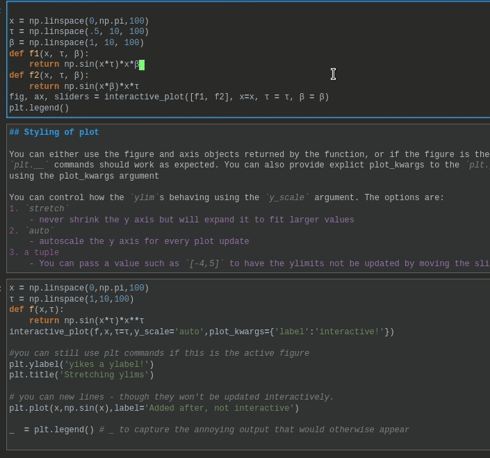
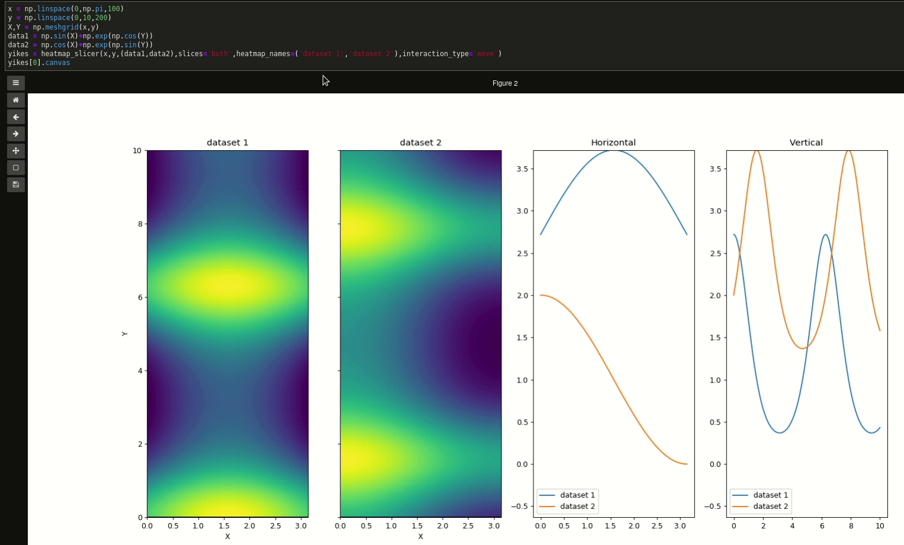

# ipympl-interactions

This library provides a different approach than `ipywidgets.interact` to make an interactive matplotlib plot. When you use `interact` you are responsible for doing all the plotting and updating the plot approriately as the slider values change. In contrast `ipympl-interactions` accepts functions in a more mathematical sense, you just need to provide `f(x, ...) => y` and the library handles all of the plotting and and boilerplate associated with keeping the plot constantly updating.

I think that `ipywidgets.interact` is great and I use it myself, but I prefer the paradigm of just defining the function I want to plot as it makes quick exploration/debugging easier. I also found that I was constantly repeating code to make the interactive plots I want and thus was born this library.


`ipympl-interaction` has three main goals:
1. Make it 5-10% easier to make an interactive plot line plot
    - Accept numpy arrays as arugments. They will become sliders with the value displayed rather than the index (contrast to selectionSlider)
    - Handle all the logic for updating the plot - you are only responsible for defining the function you want to plot
2. Provide a very niche (but very cool) way to compare 2D heatmap
3. Expand this list with other useful premade ways to interact with plots
    - Viewing slices of an array with imshow and `set_data`
    - other things ????

## Installation
```bash
pip install ipympl-interactions
```
If you use jupyterlab make sure you follow the full instructions in the ipympl readme https://github.com/matplotlib/ipympl#install-the-jupyterlab-extension in particular installing jupyterlab-manager.


## Documentation
https://ianhi.github.io/jupyter-jukebox/_build/html/Installation.html

## Examples with GIFs!
Tragically neither github nor the sphinx documentation render the actual moving plots so here are gifs of the functions. The code for these can be found in the notebooks in the examples directory.


### interactive_plot
Easily make a line plot interactive:



### heatmap_slicer
Compare vertical and horizontal slices across multiple heatmaps:

