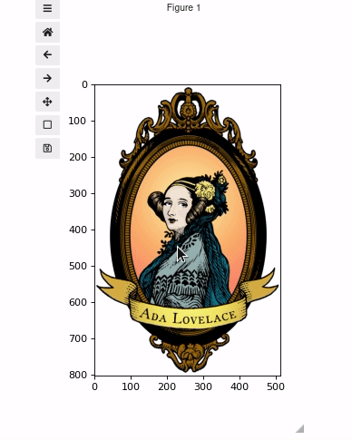

# mpl_interactions
<!-- ALL-CONTRIBUTORS-BADGE:START - Do not remove or modify this section -->
[](#contributors-)
<!-- ALL-CONTRIBUTORS-BADGE:END -->
[](https://mpl-interactions.readthedocs.io/en/latest/?badge=latest)[](https://mybinder.org/v2/gh/ianhi/mpl-interactions/master?urlpath=lab) (Warning: The interactions will be laggy when on binder)

## Welcome!

mpl_interactions' library provides helpful ways to interact with [Matplotlib](https://matplotlib.org/) plots. A summary of key components can be found below. Fuller narrative, further examples, and more information can be found on [ReadtheDocs](https://mpl-interactions.readthedocs.io/en/latest/#).

  

There are three submodules:

**pyplot**

Control Matplotlib plots using sliders and other widgets to adjust the parameters of the functions you are plotting. If working in a notebook then ipywidgets will be used to make the sliders, otherwise Matplotlib widgets will be used.

This is a different approach to controlling plots with sliders than `ipywidgets.interact` as when using `interact` you are responsible for:
1. Defining the function to plot `f(x,...) => y`
2. Handling the plotting logic (`plt.plot`, `fig.cla`, `ax.set_ylim`, etc)

In contrast, with `mpl-interactions` you only need to provide `f(x, ...) => y` and the plotting and updating boilerplate are handled for you.

```python
x = np.linspace(0,6,100)
beta = np.linspace(0,5*np.pi)
def f(x, beta):
    return np.sin(x*4+beta)
interactive_plot(f, x=x, beta=beta)
```

These functions are designed to be used with [ipympl](https://github.com/matplotlib/ipympl), the backend that is designed for use in Jupyter Notebooks. So for optimal performance, make sure you set the backend with `%matplotlib ipympl`. That said, these functions will also work with any interactive backend (e.g. `%matplotlib qt5`).


**generic**

Provides ways to interact with Matplotlib that will work outside of a Jupyter Notebook; this should work equally well with any backend.
1. A very niche (but very cool) way to compare 2D heatmaps
2. Scroll to zoom
3. Middle click to pan

**utils**

This module includes utility functions to make things just that little bit easier.

1. `ioff` as a context manager

```python
from mpl_interactions.utils import ioff
with ioff:
    # interactive mode will be off
    fig = plt.figure()
    # other stuff
# interactive mode will be on
```
2. `figure` that accepts a scalar for `figsize` (this will scale the default dimensions)
```python
from mpl_interactions.utils import figure
fig = figure(3)
# the default figsize is [6.4, 4.8], this figure will have figsize = [6.4*3, 4.8*3]
```

3. `nearest_idx` -- avoid ever having to write `np.argmin(np.abs(arr - value))` again


## Installation
```bash
pip install mpl_interactions

# if using jupyterlab
conda install nodejs=12
jupyter labextension install @jupyter-widgets/jupyterlab-manager
```
If you use JupyterLab, make sure you follow the full instructions in the ipympl [readme](https://github.com/matplotlib/ipympl#install-the-jupyterlab-extension) in particular installing jupyterlab-manager.
## Contributing / feature requests / roadmap

I use the GitHub [issues](https://github.com/ianhi/mpl-interactions/issues) to keep track of ideas I have, so looking through those should serve as a roadmap of sorts. For the most part I add to the library when I create a function that is useful for the science I am doing. If you create something that seems useful a PR would be most welcome so we can share it easily with more people. I'm also open to feature requests if you have an idea.

## Documentation

The fuller narrative documentation can be found on [ReadTheDocs](https://mpl-interactions.readthedocs.io/en/latest/). You may also find it helpful to check out the [examples directory](https://github.com/ianhi/mpl-interactions/tree/master/examples).


## Examples with GIFs!
Tragically, neither GitHub nor the sphinx documentation render the actual moving plots so instead, here are gifs of the functions. The code for these can be found in the notebooks in the examples directory.


### interactive_plot
Easily make a line plot interactive:


### heatmap_slicer
Compare vertical and horizontal slices across multiple heatmaps:


### scrolling zoom + middle click pan


## Contributors ✨

Thanks goes to these wonderful people ([emoji key](https://allcontributors.org/docs/en/emoji-key)):

<!-- ALL-CONTRIBUTORS-LIST:START - Do not remove or modify this section -->
<!-- prettier-ignore-start -->
<!-- markdownlint-disable -->
<table>
  <tr>
    <td align="center"><a href="http://ianhi.github.io"><br /><sub><b>Ian Hunt-Isaak</b></sub></a><br /><a href="https://github.com/ianhi/mpl-interactions/commits?author=ianhi" title="Code">💻</a></td>
    <td align="center"><a href="https://darlingdocs.wordpress.com/"><br /><sub><b>Sam</b></sub></a><br /><a href="https://github.com/ianhi/mpl-interactions/commits?author=samanthahamilton" title="Documentation">📖</a></td>
    <td align="center"><a href="https://github.com/jcoulter12"><br /><sub><b>Jenny Coulter</b></sub></a><br /><a href="#userTesting-jcoulter12" title="User Testing">📓</a></td>
    <td align="center"><a href="https://sjhaque14.wixsite.com/sjhaque"><br /><sub><b>Sabina Haque</b></sub></a><br /><a href="https://github.com/ianhi/mpl-interactions/commits?author=sjhaque14" title="Documentation">📖</a> <a href="#userTesting-sjhaque14" title="User Testing">📓</a> <a href="https://github.com/ianhi/mpl-interactions/commits?author=sjhaque14" title="Code">💻</a></td>
    <td align="center"><a href="https://github.com/jrussell25"><br /><sub><b>John Russell</b></sub></a><br /><a href="https://github.com/ianhi/mpl-interactions/commits?author=jrussell25" title="Code">💻</a> <a href="#userTesting-jrussell25" title="User Testing">📓</a> <a href="https://github.com/ianhi/mpl-interactions/commits?author=jrussell25" title="Documentation">📖</a></td>
  </tr>
</table>

<!-- markdownlint-enable -->
<!-- prettier-ignore-end -->
<!-- ALL-CONTRIBUTORS-LIST:END -->

This project follows the [all-contributors](https://github.com/all-contributors/all-contributors) specification. Contributions of any kind welcome!
